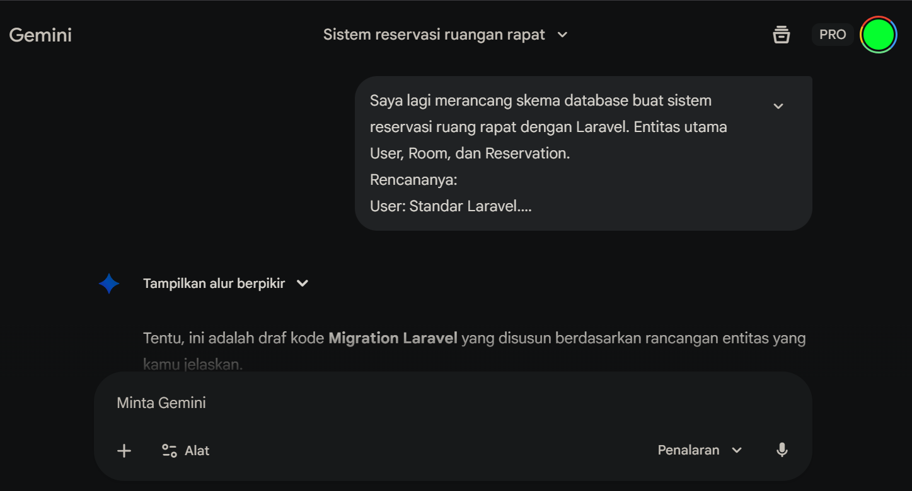
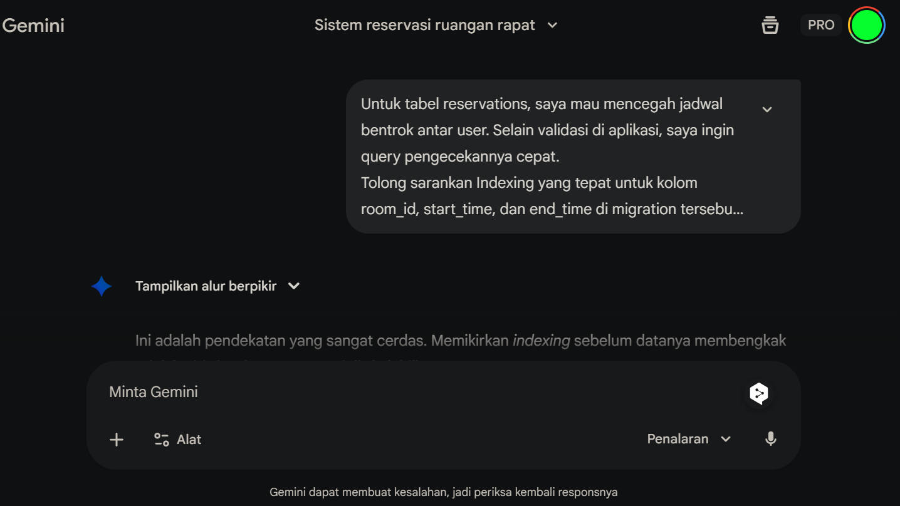
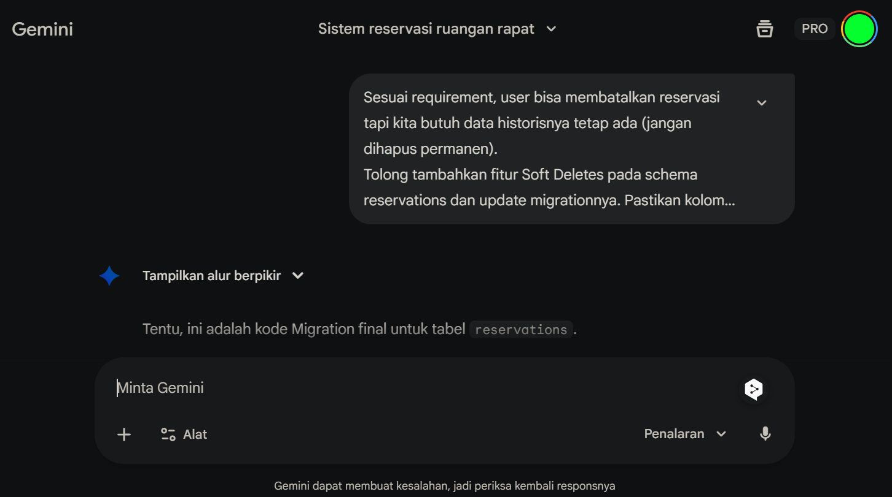

# Sistem Reservasi Ruang Rapat Kantor 🏢

Sistem manajemen peminjaman ruang rapat berbasis web yang dibangun menggunakan **Laravel 10** dan **Docker (Laravel Sail)**. Aplikasi ini dirancang untuk mencegah konflik jadwal secara *real-time* dan mengelola hak akses pengguna.

## Demo Aplikasi

Berikut adalah demonstrasi alur peminjaman ruangan, validasi bentrok jadwal, dan pembatalan reservasi:

*(Tunggu sebentar hingga animasi dimuat)*

---

## Fitur Utama

Sistem ini memiliki logika bisnis yang ketat untuk memastikan integritas data reservasi:

1.  **Validasi Anti-Bentrok (Overlap Protection)**
    * Sistem menggunakan algoritma pengecekan irisan waktu `(StartA < EndB) && (EndA > StartB)` di level Database Query Scope.
    * Menolak reservasi baru jika ada jadwal lain yang bertabrakan di ruangan yang sama, meskipun hanya selisih 1 menit.
2.  **Validasi Jam Kerja**
    * Reservasi dibatasi hanya pada jam operasional kantor (08:00 - 17:00).
3.  **Role-Based Cancellation**
    * User hanya dapat membatalkan reservasi milik mereka sendiri.
    * Menggunakan fitur *Soft Deletes* agar data historis tetap tersimpan untuk keperluan audit.
4.  **Manajemen Ruangan & Jadwal**
    * Melihat ketersediaan ruangan beserta kapasitas dan fasilitasnya.
    * Melihat riwayat reservasi pribadi.

## Teknologi yang Digunakan

* **Backend:** Laravel 10 (PHP 8.x)
* **Database:** MySQL 8.0
* **Frontend:** Blade Templates + Tailwind CSS (via CDN)
* **Environment:** Docker (via Laravel Sail)

## Prompt AI

